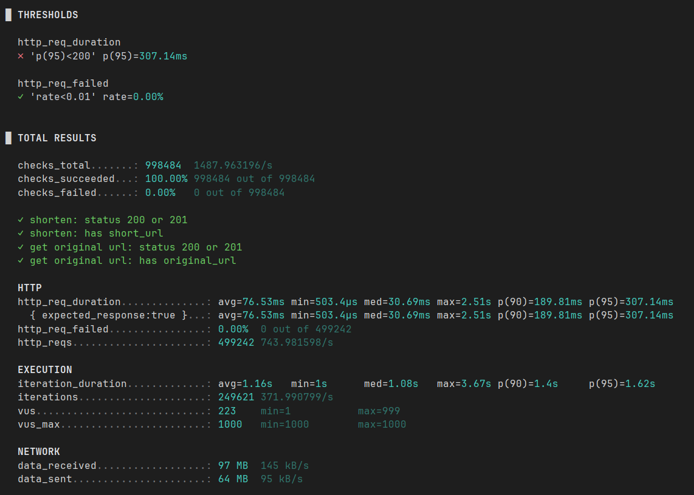
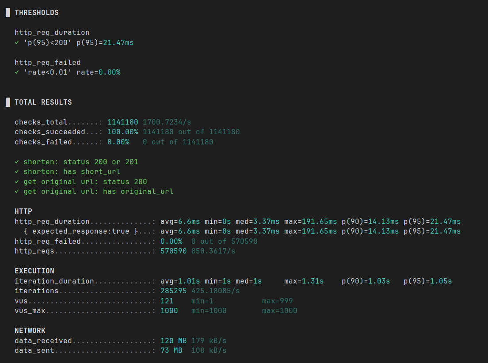

# url-shortener - API для создания укороченных ссылок

Задание описано в файле TASK.md

------------------

# API:

### POST /api/shorten

Создать короткую ссылку

**Request:**
```json
{
  "url": "https://example.com"
}
```

**Response:**
```json
{
  "short_url: "http://localhost:8080/AAAAAAAA/redirect"
}
```


### GET /api/:short
Получение оригинальной ссылки в JSON:

**Response:**
```json
{
  "original_url": "https://example.com"
}
```

### GET /:short/redirect

Перенаправление пользователя на сайт оригинальной ссылки

------------
# Инициализация проекта 

Развертывание проекта осуществляется с помощью Dockerfile, процесс описан в **docker-compose.yml** (для in-memory-реализации)
и в файле **docker-compose.postgres.yml** (для PostgreSQL-реализации). 

Для запуска необходимо:


1. Склонировать репозиторий
```bash 
git clone https://github.com/loloneme/potential-waffle.git
```

2. Запустить проект с помощью Make


* #### Для in-memory-реализации:

```bash
make with-in-memo-docker-up
```

ЛИБО С ПОМОЩЬЮ ФЛАГА (так как in-memory не требует сторонних зависимостей)

```bash
go run cmd/main/main.go --storage=memory
```


* #### Для PostgreSQL-реализации:
```bash
make with-postgres-docker-up
```

3. Для просмотра остальных доступных Make команд:

```bash 
make help
```

После выполнения всех шагов обращаться к приложению можно по адресу http://localhost:8080

------------------

# Детали

## Архитектура проекта

Последние свои проекты я пишу с подобной архитектурой, где каждый слой не зависит от реализации
других слоев и легко масштабируется

Так, приложение состоит из 3 основных уровней:

1. Транспортный уровень - **api** эндпоинты, модели ответов и запросов, валидация входных даннных и возврат 
HTTP-кодов и ошибок наверх, а также логирование ошибок 
2. Уровень бизнес-логики - **service**, который реализуют необходимую для работы эндпоинтов бизнес-логику, а также **domain**,
в котором описаны бизнес-модели и бизнес-логика, которая используется в сервисах (shortgen)
3. Уровень репозитория - **persistence**, который реализует связь с хранилищем. Здесь представлены две реализации хранилища -
**In-Memory** подход с использованием hashmap (где значение получается за O(1)) и **PostgreSQL** подход с использованием сторонней БД.


## Graceful Shutdown

Реализован в функции main() для корректной остановки работы приложения. При получении сигнала об остановке сервиса
срабатывает ctx.Done(), после чего приложение ждет завершения работы эндпоинтов 10 секунд

## Логирование

Для логирования используется пакет log/slog и логирование в виде JSON. Также, для каждого запроса echo-middleware 
создает свой уникальный RequestID, который необходим для анализа логов, относящихся к одному и тому же запросу. 

ReqestID прокидывается в контекст запроса, который передается далее и используется в хэндлерах для логирования событий

## Обработка ошибок

Ошибки логируются на уровне хэндлеров, с нижних слоев ошибки прокидываются наверх с помощью fmt.Errorf

Для того, чтобы не использовать ошибки Repository-уровня (sql.ErrNoRows) и 
обеспечить единый формат возвращаемых ошибок для In-Memory и PostgreSQL, было принято решение
вынести ошибки в domain-слой и использовать их, а необходимые SQL-ошибки приводить к виду ошибок domain-уровня

## Миграции

Для миграций используется инструмент flyway. И хоть в данном проекте нет новых версий или изменения БД, этот инструмент
все равно очень удобен для использования

## Unit-тестирование

Юнит-тестирование было применено к следующим частям приложения:
* хэндлеры (api), для которых были сгенерированы моки
* сервисы, для которых так же было сгенерированы моки
* in-memory реализация хранилища
* shortgen - генератор коротких ссылок

## Нагрузочное тестирование

Было проведено нагрузочное тестирование с целью проверить, как ведет себя система под нагрузкой до 1000 одновременных
пользователей. 
Для нагрузочного тестирования использовался инструмент k6, конфигурация описана в файле **load_test.js**

* с **PostgreSQL**:
Сервис выдерживает нагрузку, однако запросы проходят довольно медленно

* с **InMemory-хранилищем**: 
Сервис не просто выдерживает нагрузку, но и работает максимально быстро


## Алгоритм генерации короткой ссылки

Был выбран алгоритм, использующий id записи. Он использует id, переводит его в систему счисления с основанием 63 (длина 
алфавита) и сохраняет полученный код. Таким образом, повторений не происходит, так как алгоритм не рандомен. Количество
записей может достигать до 63^10

--------------------

# Проблемы, с которыми я столкнулась

## Выбор алгоритма
Изначально был выбран алгоритм рандомной генерации строки длиной 10 из необходимых символов. При коллизиях необходимо 
было сгенерировать новую строку, количество попыток было 5. Да, в большинстве случаев это может обеспечить уникальность
и работу приложения, однако:

### Проблема
При нагрузочном тестировании я столкнулась с коллизиями, с data race при использовании rand.Rand, и, как следствие, ошибками.
Проблему с data race можно было бы решить, используя Mutex, однако сам алгоритм оказался ненадежным для случаев, когда 
приложением пользуется множество человек.

### Решение
Переход на использование другого алгоритма - перевод числового ID ссылки в систему с основанием 63. 
Таким образом обеспечивается уникальность коротких ссылок, так как они следуют друг за другом - AAAAAAAAAB, AAAAAAAAAC и так далее.
Данное решение потребовало переписывания бизнес-логики, тестов, запросов к БД и In-Memory хранилищу. Отсюда образовались следующие
проблемы:

## Метод Save
Сохранение записей и генерация коротких ссылок после смены алгоритма

### Проблема
Необходимо было обеспечить атомарность и идемпотентность операции. Для алгоритма необходимо
сначала получить ID записи -> из этого ID сформировать короткую ссылку.

#### In-Memory
Здесь решение было простым: за счет использования **sync.RWMutex**, мапы, в которых хранятся данные, блокировались для 
остальных запросов, что делало операции записи и чтения атомарными. Однако, с появлением небоходимости вести числовой ID, 
потребовалось завести счетчик **counter**, который меняется так же в блоке _mu.Lock()_ - _mu.Unlock()_

#### БД

В данном случае решение потребовало серьезных изменений метода. Вместо простого сохранения уже сгенерированной короткой
ссылки, необходимо было:
1. Получить следующий id (а если уже появилась запись с этим url?)
2. Сгенерировать короткую ссылку по этому id 
3. Добавить эту короткую ссылку

Решение с получением следующего значения путем ```SELECT next_val``` было неплохим. Однако, в случае
большого количества пользователей, некоторые id могут просто пропасть из БД. Например: получили id -> за это время уже 
появилась запись с этим original url (https://example.com) -> невозможно вставить новую запись с этим url -> id потерялся

Тогда было решено использовать транзакцию: начинать транзакцию с INSERT, далее вычислять короткую ссылку и делать UPDATE.
Однако, в случае, если мы пытаемся вставить уже существующий original_url, нужно вернуть эту существующую запись. Эта
операция с получением уже существующей записи была вынесена за транзакцию

## Нагрузка на БД

Необходимо обеспечивать работу сервиса для сотен пользователей

### Проблема
При нагрузочном тестировании выявилось, что БД плохо справляется с 1000 VU и в какой-то момент каждый запрос
выдает ошибку вида:
```json
"error": "failed to get by original: failed to find shortened url: failed to connect to user=postgres database=shortened_urls: 172.25.0.2:5432 (postgres): dial error: dial tcp 172.25.0.2:5432: operation was canceled"
```

### Решение
Настроить пул соединений PostgreSQL, так как PostgreSQL максимум открывает 100 соединений, остальные ждут и могут отмениться.
Поэтому нужно было прописать максимальное количество соединений, кол-во простаивающих соединений и их время жизни. 

Данные переменные можно обозначить через env, default-значения были взяты путем интернет-поиска и установки усредненных 
значений
